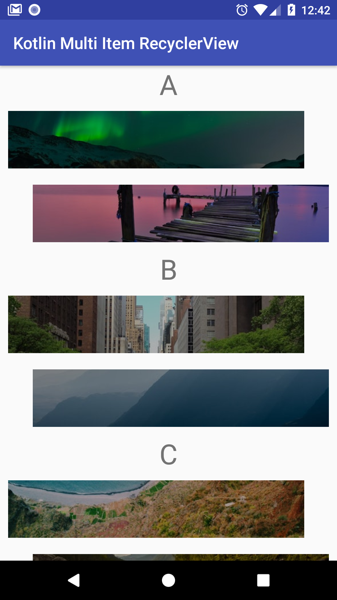

# EasyKotlinRecyclerView

An example implementation of a RecyclerView with multiple view types using Kotlin.

Kotlin's android extensions plugin now has experimental support for synthetic properties in View Holders. It makes it extremely easy to manage RecyclerViews since individual view holder implementations for each view type aren't required.

The app also uses the current best practice of using R.layout.ids as the view type to further simplify the Adapter

